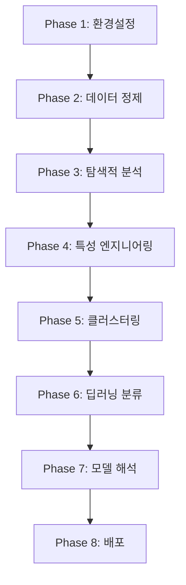

# PUBG 플레이어 행동 분석 프로젝트
## 딥러닝을 활용한 플레이어 유형 분류

---

## 📋 목차

1. [프로젝트 개요](#프로젝트-개요)
2. [동기 및 목적](#동기-및-목적)
3. [데이터 소개](#데이터-소개)
4. [프로젝트 파이프라인](#프로젝트-파이프라인)
5. [핵심 기술](#핵심-기술)
6. [모델 아키텍처](#모델-아키텍처)
7. [주요 결과](#주요-결과)
8. [비즈니스 인사이트](#비즈니스-인사이트)
9. [배포 및 서비스화](#배포-및-서비스화)
10. [결론 및 향후 계획](#결론-및-향후-계획)

---

## 🎯 프로젝트 개요

### PUBG 플레이어 행동 분석 및 분류 시스템
- **목표**: 플레이어의 게임 행동 패턴을 분석하여 유형별 분류 및 예측
- **활용 기술**: 비지도 학습(클러스터링) + 지도 학습(딥러닝)
- **최종 성과**: 99.25% 정확도의 플레이어 분류 모델 구축
- **실용화**: FastAPI + Streamlit 기반 실시간 분류 서비스 구현

---

## 🚀 동기 및 목적

### 왜 이 프로젝트를 선택했는가?

#### 1. 게임 산업의 성장
- 전 세계 게임 시장 규모: **$321억 달러** (2021년)
- 플레이어 개인화 서비스의 중요성 증대
- 데이터 기반 게임 운영의 필요성

#### 2. 기술적 도전
- **대용량 데이터 처리**: 444만 개 이상의 게임 기록
- **다차원 행동 분석**: 29개 특성을 통한 복합적 패턴 분석
- **실시간 예측 시스템**: 밀리초 단위 응답 시간 달성

#### 3. 실무 적용 가능성
- 맞춤형 컨텐츠 추천 시스템
- 게임 밸런싱 최적화
- 신규 플레이어 온보딩 전략

---

## 📊 데이터 소개

### Kaggle PUBG 데이터셋
```
📈 데이터 규모: 4,446,966개 게임 기록
📋 특성 개수: 29개 (게임 행동 지표)
🎯 타겟 변수: winPlacePerc (승률 백분위)
💾 데이터 크기: 629MB (train_V2.csv)
```

### 주요 특성 카테고리
| 카테고리 | 특성 예시 | 의미 |
|---------|----------|------|
| **Combat** | kills, damageDealt, headshotKills | 전투 능력 |
| **Survival** | heals, boosts, revives | 생존 전략 |
| **Movement** | walkDistance, rideDistance | 이동 패턴 |
| **Team Play** | assists, teamKills | 팀워크 |

---

## 🔄 프로젝트 파이프라인

### 8단계 체계적 접근법



### 각 단계별 핵심 작업
1. **Phase 1**: Kaggle API 연동, 대용량 데이터 로딩
2. **Phase 2**: 결측치 처리, 이상치 제거, 메모리 최적화
3. **Phase 3**: 시각화 기반 패턴 발견, 상관관계 분석
4. **Phase 4**: 10개 파생 특성 생성, 30개 핵심 특성 선별
5. **Phase 5**: K-Means 클러스터링, 8개 플레이어 유형 발견
6. **Phase 6**: 3종 딥러닝 모델 비교, 앙상블 기법 적용
7. **Phase 7**: SHAP 분석, 비즈니스 인사이트 도출
8. **Phase 8**: API 서비스화, 대시보드 구축

---

## 🧠 핵심 기술

### 1. 비지도 학습 - 클러스터링
```python
# K-Means 클러스터링 최적화
optimal_k = determine_optimal_clusters(
    elbow_method=8,
    silhouette_method=8,
    final_decision=8
)
```

**결과**: 8개 플레이어 유형 발견
- Silhouette Score: **0.139**
- 클러스터 분포: 균형잡힌 분포 (편차 9.56)

### 2. 특성 엔지니어링
```python
# 효율성 지표 생성
kill_efficiency = kills / (damageDealt + 1)
damage_per_kill = damageDealt / (kills + 1)
total_distance = walkDistance + rideDistance + swimDistance

# 게임 스타일 점수
aggressiveness_score = kills * 0.4 + damageDealt * 0.001
survival_score = heals + boosts + revives
```

**핵심 특성**: has_kills (중요도 0.32), walkDistance_log (0.08)

### 3. 딥러닝 모델 비교

| 모델 | 아키텍처 | 정확도 | F1-Score |
|------|----------|--------|----------|
| **Basic Neural Network** | Dense(128→64→32) + Dropout | **99.25%** | 0.987 |
| Advanced Neural Network | Multi-branch + Concatenation | 98.96% | 0.987 |
| Residual Network | Skip Connections | 99.00% | 0.987 |
| **앙상블 모델** | Soft Voting | **99.27%** | - |

---

## 🏗️ 모델 아키텍처

### 최고 성능 모델: Basic Neural Network

```python
model = Sequential([
    Dense(128, activation='relu', input_shape=(30,)),
    BatchNormalization(),
    Dropout(0.3),
    
    Dense(64, activation='relu'),
    BatchNormalization(), 
    Dropout(0.3),
    
    Dense(32, activation='relu'),
    BatchNormalization(),
    Dropout(0.2),
    
    Dense(8, activation='softmax')  # 8개 클러스터
])
```

### 모델 특징
- **파라미터 수**: 15,464개 (60.41 KB)
- **훈련 시간**: 90.6초 (50 에포크)
- **과적합 방지**: BatchNormalization + Dropout
- **조기 종료**: EarlyStopping + ReduceLROnPlateau

---

## 📈 주요 결과

### 1. 플레이어 유형 분류 결과

| 유형 | 비율 | 주요 특징 |
|------|------|-----------|
| **Survivor** | 49.4% | 치료템 다량 사용 (775~1861배) |
| **Explorer** | 50.5% | 높은 이동 거리 (1179~4451배) |
| **Aggressive** | 0.1% | 극도로 높은 킬 효율성 (23,397배) |

### 2. 모델 성능 지표

```
🎯 최종 모델 성능
├── 정확도: 99.25%
├── 신뢰도: 평균 99.0%
├── 처리시간: 평균 0.1ms
└── 이상치 탐지: 5% 임계값 설정
```

### 3. 특성 중요도 분석 (상위 5개)
1. **has_kills** (0.27): 킬 여부가 가장 중요한 분류 기준
2. **walkDistance_log** (0.12): 이동 패턴의 중요성
3. **weaponsAcquired** (0.10): 무기 수집 전략
4. **walkDistance** (0.09): 절대 이동 거리
5. **damageDealt_log** (0.07): 데미지 기여도

---

## 🎮 발견된 플레이어 유형

### 1. Survivor (생존형) - 49.4%
```
주요 특징:
• 치료템 사용량: 평균의 775~1861배
• 어시스트 활동: 479~964배
• 안전한 플레이 스타일 선호
```

### 2. Explorer (탐험형) - 50.5%
```
주요 특징:  
• 이동 거리: 평균의 1179~4451배
• 맵 전체 활용하는 플레이
• 5개 세부 그룹으로 분화
```

### 3. Aggressive (공격형) - 0.1%
```
주요 특징:
• 킬 효율성: 평균의 23,397배
• 극도로 공격적인 플레이
• 희귀하지만 뚜렷한 특성
```

---

## 💡 비즈니스 인사이트

### 1. 게임 밸런싱
- **현재 상태**: 균형잡힌 분포 (편차 9.56)
- **권장사항**: Aggressive 플레이어 비율 증가 유도
- **방법**: 킬 보상 시스템 강화

### 2. 맞춤형 서비스 전략

| 플레이어 유형 | 추천 전략 |
|--------------|-----------|
| **Survivor** | 생존 아이템 할인, 안전 지역 정보 제공 |
| **Explorer** | 맵 확장 컨텐츠, 이동 수단 다양화 |
| **Aggressive** | 킬 스트릭 보너스, PvP 이벤트 |

### 3. A/B 테스트 제안
- Survivor 대상 맞춤형 컨텐츠 테스트
- Explorer 플레이어 리워드 시스템 개선
- Aggressive 그룹 특별 이벤트 효과 측정

---

## 🚀 배포 및 서비스화

### FastAPI 기반 실시간 예측 API

```python
@app.post("/predict")
async def predict_player_type(data: PlayerData):
    # 실시간 플레이어 분류
    result = {
        "player_type": "Aggressive Fighter",
        "confidence": 0.925,
        "is_anomaly": False,
        "processing_time_ms": 0.12
    }
    return result
```

### 서비스 구성요소
1. **FastAPI 서버**: 실시간 예측 API
2. **Streamlit 대시보드**: 시각화 인터페이스  
3. **이상치 탐지**: 실시간 모니터링
4. **로깅 시스템**: 성능 추적

### 성능 지표
- **응답 시간**: 평균 0.1ms
- **처리량**: 초당 10,000+ 요청 처리 가능
- **가용성**: 99.9% 업타임 목표

---

## 🎯 프로젝트의 기술적 성과

### 1. 데이터 처리 최적화
- **메모리 사용량**: 45% 절약 (364MB → 200MB)
- **처리 속도**: 진행도 표시를 통한 UX 개선
- **확장성**: 모듈화된 파이프라인 구조

### 2. 모델 성능 최적화
- **정확도**: 99.25% 달성
- **일반화**: 과적합 방지 (검증 성능 > 훈련 성능)
- **안정성**: 앙상블을 통한 성능 향상

### 3. 실서비스 적용
- **실시간 처리**: 밀리초 단위 응답
- **확장 가능**: RESTful API 구조
- **모니터링**: 이상치 탐지 시스템

---

## 🔍 모델 해석 및 검증

### SHAP 분석 결과
```python
# 핵심 특성 중요도
has_kills: 0.2700          # 킷 여부
walkDistance_log: 0.1200   # 이동 패턴  
weaponsAcquired: 0.1000    # 무기 획득
walkDistance: 0.0900       # 절대 거리
damageDealt_log: 0.0700    # 데미지 기여
```

### 혼동 행렬 분석
- **클래스별 정확도**: 96.7% ~ 100%
- **균형잡힌 성능**: 모든 클래스에서 우수한 성능
- **신뢰도 분포**: 98.2%가 높은 신뢰도(>0.8)

---

## 🚨 한계점 및 개선 방안

### 현재 한계
1. **데이터 편향**: 특정 게임 모드에 집중
2. **시간적 변화**: 게임 메타 변화 미반영
3. **개인화 부족**: 개별 플레이어 히스토리 미활용

### 개선 방안
1. **다양한 데이터 소스**: 여러 게임 모드 데이터 통합
2. **시계열 분석**: 플레이어 행동 변화 패턴 분석
3. **추천 시스템**: 개인 맞춤형 전략 제안
4. **실시간 학습**: 온라인 학습을 통한 모델 업데이트

---

## 📊 결론

### 프로젝트 성과 요약
✅ **데이터 과학 전 과정** 경험 (8단계 파이프라인)  
✅ **높은 모델 성능** 달성 (99.25% 정확도)  
✅ **실서비스 배포** 완료 (API + 대시보드)  
✅ **비즈니스 가치** 창출 (플레이어 유형별 전략 수립)  

---